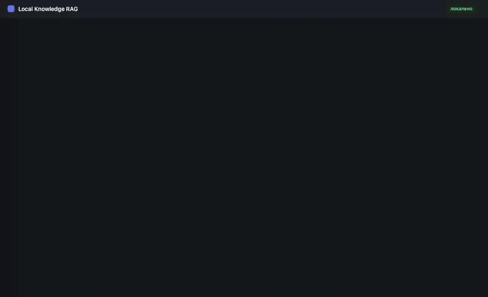
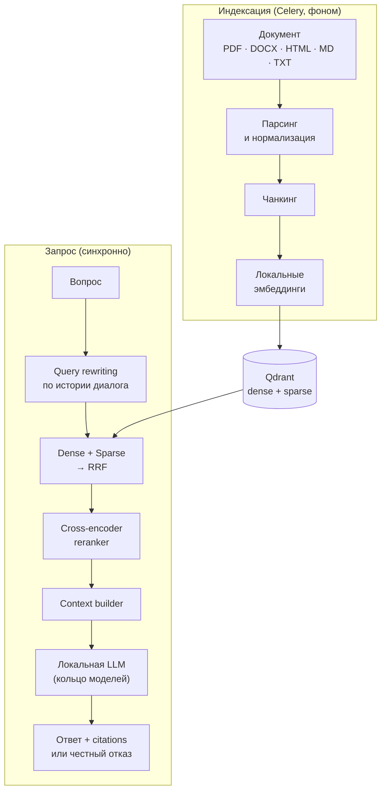
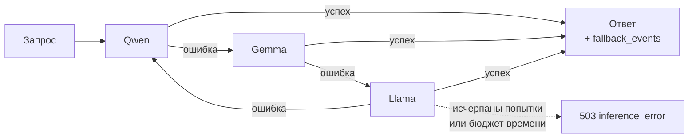

# Local Knowledge RAG Platform


Полностью локальная RAG-платформа для интеллектуального поиска и ответов
по внутренним документам организации.

> **найди → отфильтруй → проверь → объясни → покажи источник — полностью локально.**



*Загрузка документа → фоновая индексация → ответ со ссылкой на источник →
вопрос, ответа на который в базе нет. Модель `qwen3:14b` на Apple M4 Max,
запись без монтажа и ускорения — латентность в кадре настоящая.*

То же самое с паузой и перемоткой:

https://github.com/user-attachments/assets/28a32b1c-ca8f-42ae-aa0e-f0ad5f01808f

## Ключевой инвариант

Документы, chunks, embeddings, retrieved context и пользовательские запросы
**не покидают локальную инфраструктуру**. Скрытого cloud fallback не существует:
если локальный inference недоступен, API возвращает `503 inference_error`,
а не отправляет корпоративный контекст во внешний AI-провайдер.

Отсюда следует и вся отказоустойчивость системы: подстраховаться облаком
нельзя, поэтому запас прочности набирается локально — [кольцом моделей](#отказоустойчивость-кольцо-моделей)
и [честным отказом](#честный-отказ) вместо выдуманного ответа.

## Содержание

- [Особенности](#особенности) · [Как это работает](#как-это-работает)
- [Отказоустойчивость: кольцо моделей](#отказоустойчивость-кольцо-моделей) · [Честный отказ](#честный-отказ) · [Профили железа](#профили-железа)
- [Быстрый старт](#быстрый-старт) · [Веб-интерфейс](#веб-интерфейс) · [Аутентификация](#аутентификация) · [API](#api) · [Конфигурация](#конфигурация)
- [Тесты](#тесты) · [Наблюдаемость](#наблюдаемость) · [Оценка качества](#оценка-качества) · [Статус](#статус)

## Особенности

| Возможность | Как устроена |
|---|---|
| **Свой RAG-пайплайн** | Без LangChain, LlamaIndex и прочих orchestration-фреймворков. Каждый слой — chunking, retrieval, fusion, reranking, context building — можно прочитать и понять целиком |
| **Hybrid retrieval** | Dense-эмбеддинги ловят смысловую близость, sparse-векторы — точные лексические совпадения (номера статей, коды); объединяются через Reciprocal Rank Fusion |
| **Локальный reranker** | Cross-encoder сужает 20–30 кандидатов до лучших 5–10. Опциональный extra: базовая установка остаётся лёгкой |
| **Grounded-ответы с citations** | Модель обязана ссылаться на номера фрагментов; ссылки на несуществующие фрагменты отбрасываются |
| **Честный отказ** | При нехватке данных возвращается «ответа нет» с машиночитаемой причиной, а не догадка |
| **Hardware-aware выбор моделей** | Детекция CPU/RAM/GPU/VRAM, рекомендация профиля LIGHT/STANDARD/PERFORMANCE с возможностью переопределить вручную |
| **Кольцевой fallback** | Qwen → Gemma → Llama с health-состояниями, cooldown и ограничением попыток на один запрос |
| **Изоляция и права** | База знаний — единица изоляции; роли VIEWER/EDITOR/OWNER применяются и как фильтр retrieval |
| **Версионирование документов** | Новая версия документа загружается поверх старой, история версий сохраняется; переиндексация при смене чанкинга или embedding-модели версию не плодит |
| **Наблюдаемость** | Метрики Prometheus и готовый дашборд Grafana из коробки |
| **Веб-интерфейс** | Отдаётся тем же приложением: базы знаний, загрузка документов, поиск, вопрос-ответ и состояние кольца моделей — без отдельной сборки и node-тулчейна |

## Как это работает



Метаданные документов, диалоги и права живут в PostgreSQL, векторы — в Qdrant,
очередь индексации — в Redis/Celery.

## Отказоустойчивость: кольцо моделей

Локальный inference падает иначе, чем облачный: модель может не поместиться в
память, runtime — перезапуститься, генерация — упереться в таймаут. Уйти в
облако нельзя (см. [ключевой инвариант](#ключевой-инвариант)), поэтому три
семейства моделей выстроены в **непрерывное кольцо**: при ошибке запрос
уходит следующей модели, а не пользователю.



Кольцо непрерывно на уровне сервиса, но **один запрос по нему не циркулирует
бесконечно**: его ограничивают `MODEL_RING_MAX_ATTEMPTS` (по умолчанию 3) и
`MODEL_RING_TIMEOUT_BUDGET_S` (45 с). Модели, ушедшие в cooldown, пропускаются
без ожидания — текущий запрос не платит за чужую деградацию.

Каждая модель кольца живёт в одном из состояний:

| Состояние | Когда наступает | Что значит для запроса |
|---|---|---|
| `healthy` | Последняя генерация успешна | Обычный кандидат |
| `degraded` | Была ошибка, но порог ещё не достигнут | Ещё используется, попытки считаются |
| `cooldown` | `MODEL_RING_FAILURE_THRESHOLD` ошибок подряд (по умолчанию 2) | Пропускается `MODEL_RING_COOLDOWN_S` секунд (60 с) |
| `unavailable` | Модель не установлена в runtime | Пропускается до загрузки весов |

Восстановление автоматическое: по истечении cooldown модель возвращается в
кольцо как `degraded` и получает ещё один шанс — «чинить» её вручную не нужно.
Переключения не молчаливые: каждое попадает в лог, в метрики и в трассировку
запроса, так что деградация видна на дашборде, а не только по возросшей латентности.

Текущее состояние кольца:

```bash
curl http://localhost:8000/inference/status
```

Кольцо отключается через `MODEL_RING_ENABLED=false` — тогда используется одна
модель из `LLM_MODEL`.

## Честный отказ

Retrieval сам по себе молчать не умеет: косинусная близость не бывает нулевой,
и на вопрос без ответа в базе он всё равно вернёт документы. Поэтому решение
«ответа нет» принимает отдельная политика — по собранному контексту и по тому,
что вернула модель. Ответ приходит с `has_answer: false` и причиной:

| Код | Что произошло |
|---|---|
| `empty_context` | Retrieval не дал ни одного фрагмента |
| `below_threshold` | Найденное не прошло порог релевантности (если он задан) |
| `model_declined` | Модель сама сообщила, что данных недостаточно |
| `no_citations` | Ответ был, но не сослался ни на один реальный фрагмент — проверить его нечем |

Порог релевантности по умолчанию выключен: он живёт в шкале конкретной
embedding-модели, и зашитое число врало бы при её замене. Подбирается прогоном
`scripts/evaluate_retrieval.py`, где видна цена — ложные срабатывания падают
вместе с Recall.

## Профили железа

`GET /system/hardware` определяет CPU/RAM/GPU/VRAM и рекомендует профиль;
рекомендация переопределяется через `HARDWARE_PROFILE_OVERRIDE`.

| Профиль | Требования | Кольцо моделей |
|---|---|---|
| **LIGHT** | от 8 ГБ RAM, GPU не нужен | `qwen3:4b` → `gemma3:4b` → `llama3.1:8b` |
| **STANDARD** | от 24 ГБ RAM и 12 ГБ VRAM | `qwen3:14b` → `gemma3:12b` → `llama3.1:8b` |
| **PERFORMANCE** | от 64 ГБ RAM и 24 ГБ VRAM | `qwen3:32b` → `gemma3:27b` → `llama3.1:70b` |

На Apple Silicon память унифицирована, поэтому VRAM отдельно не проверяется —
профиль выбирается по общему объёму RAM.

## Быстрый старт

### Через Docker Compose

Поднимает всё сразу — приложение, воркер, PostgreSQL, Qdrant и Redis:

```bash
cp .env.example .env
```

Запустить сервисы:

```bash
SECRET_KEY=$(openssl rand -hex 32) docker compose up -d
```

После запуска интерфейс открывается на [localhost:8000](http://localhost:8000),
схема API — на [localhost:8000/docs](http://localhost:8000/docs).

Ollama остаётся на хосте: в контейнере нет доступа к Metal на macOS и к GPU
на Linux без отдельной настройки.

Две особенности контейнера, о которых стоит знать сразу:

| Что | Почему | Как переопределить |
|---|---|---|
| Reranking выключен | В образ не ставится extra `reranking` — torch тянет ~2.5 ГБ | Собрать образ с этим extra и `RERANK_ENABLED=true` |
| Профиль занижается | Детекция железа внутри контейнера видит лимиты Docker, а не хост: на macOS это обычно 4–8 ГБ RAM и `gpu: none` | `HARDWARE_PROFILE_OVERRIDE=standard docker compose up -d` |

### Локально

```bash
cp .env.example .env
```

Запустить хранилища:

```bash
docker compose up -d postgres qdrant redis
```

Установить зависимости:

```bash
uv sync
```

Применить миграции:

```bash
uv run alembic upgrade head
```

Запустить API:

```bash
uv run uvicorn app.main:app --reload
```

Reranking по умолчанию не устанавливается: cross-encoder тянет torch
(~2.5 ГБ). Если он нужен — `uv sync --extra reranking`, иначе выключите
его через `RERANK_ENABLED=false`.

Индексация документов идёт в фоне, поэтому нужен ещё воркер — в отдельном
терминале:

```bash
uv run celery -A app.workers.celery_app:celery_app worker --loglevel=info
```

Интерфейс — на [localhost:8000](http://localhost:8000), документация API —
[Swagger UI](http://localhost:8000/docs).

### Локальные модели

Проверить, что обнаружено и чего не хватает:

```bash
curl http://localhost:8000/system/hardware
```

Найденные Ollama / vLLM:

```bash
curl http://localhost:8000/inference/runtimes
```

Кольцо моделей и недостающие веса:

```bash
curl http://localhost:8000/inference/status
```

Загрузка модели запускается **только явным запросом** — приложение не тянет
многогигабайтные веса по своей инициативе:

```bash
curl -X POST http://localhost:8000/inference/models/qwen3:4b/download
```

Проверить прогресс загрузки:

```bash
curl http://localhost:8000/inference/downloads/qwen3:4b
```

Нужна ещё embedding-модель: `ollama pull nomic-embed-text`.

## Веб-интерфейс

Приложение отдаёт интерфейс на корне (`/`), статику — из `/ui`. Отдельного
процесса, сборки и настройки CORS не нужно: страница и API живут на одном
origin, а сам интерфейс написан без фреймворка и сборочного тулчейна —
[app/web/static/](app/web/static/).

Что в нём есть:

| Экран | Что делает |
|---|---|
| Базы знаний | Создание и переключение; список ограничен доступными пользователю |
| Документы | Загрузка и статус индексации, который обновляется, пока воркер работает |
| Вопрос-ответ | Ответ с источниками, использованной моделью и латентностью; при нехватке данных — блок «ответа в документах нет» с причиной |
| Поиск | Фрагменты и их score без генерации — видно, что именно нашёл retrieval |
| Кольцо моделей | Состав кольца и здоровье каждой модели, включая `не установлена` |

Тема следует системной настройке — светлая и тёмная описаны токенами
в [styles.css](app/web/static/styles.css), отдельного переключателя нет.

Интерфейс — не отдельный продукт, а витрина API: всё, что он делает, доступно
теми же публичными эндпоинтами.

## Аутентификация

`/system`, `/inference` и `/metrics` открыты, остальные группы требуют
JWT-токена — без заголовка `Authorization` они отвечают `401`:

```bash
curl -X POST http://localhost:8000/auth/register \
  -H 'Content-Type: application/json' \
  -d '{"email": "me@example.com", "password": "change-me-please"}'
```

Войти и сохранить токен:

```bash
TOKEN=$(curl -s -X POST http://localhost:8000/auth/login \
  -H 'Content-Type: application/json' \
  -d '{"email": "me@example.com", "password": "change-me-please"}' \
  | python -c 'import json,sys; print(json.load(sys.stdin)["access_token"])')
```

Получить доступные базы знаний:

```bash
curl http://localhost:8000/knowledge-bases -H "Authorization: Bearer $TOKEN"
```

Создатель базы знаний становится её владельцем; остальным доступ выдаётся
явно — `POST /knowledge-bases/{id}/permissions` с ролью `viewer`, `editor`
или `owner`. Права проверяются не только на входе в эндпоинт, но и как фильтр
retrieval: фрагменты чужой базы знаний не попадают даже в контекст ответа.

Токены подписываются `SECRET_KEY` — в проде его обязательно переопределить.

## API

| Группа | Назначение | Токен |
|---|---|:---:|
| `/` и `/ui` | Веб-интерфейс и его статика | — |
| `/auth` | Регистрация, вход, текущий пользователь | — |
| `/system` | Состояние приложения, железо, рекомендуемый профиль | — |
| `/inference` | Runtime'ы, кольцо моделей, их установка и загрузка | — |
| `/metrics` | Метрики Prometheus | — |
| `/knowledge-bases` | Базы знаний, их удаление и права доступа | ✅ |
| `/documents` | Загрузка, версии, переиндексация, статус и удаление | ✅ |
| `/indexing-jobs` | Прогресс фоновой индексации | ✅ |
| `/search` | Поиск по базе знаний без генерации | ✅ |
| `/conversations` | Диалоги и история сообщений | ✅ |
| `/chat` | Вопрос-ответ с citations | ✅ |

Поддерживаемые форматы документов: PDF, DOCX, HTML, Markdown, TXT.

Ответ `/chat` кроме текста и citations возвращает `has_answer`, причину отказа,
использованную модель и провайдера, латентность и переписанный запрос — то есть
всё, по чему ответ можно проверить, не заглядывая в логи.

## Конфигурация

Все параметры — через переменные окружения, см. [.env.example](.env.example):

| Блок | Ключевые переменные |
|---|---|
| Хранилища | `POSTGRES_*`, `QDRANT_URL`, `REDIS_URL`, `CELERY_TASK_ALWAYS_EAGER` |
| Auth | `SECRET_KEY`, `ACCESS_TOKEN_TTL_S` |
| Inference | `INFERENCE_PROVIDER=ollama\|vllm`, `OLLAMA_URL`, `VLLM_URL`, `LLM_MODEL`, `EMBEDDING_MODEL` |
| Кольцо моделей | `MODEL_RING_ENABLED`, `MODEL_RING_MAX_ATTEMPTS`, `MODEL_RING_TIMEOUT_BUDGET_S`, `MODEL_RING_COOLDOWN_S`, `MODEL_RING_FAILURE_THRESHOLD` |
| Retrieval | `HYBRID_RETRIEVAL_ENABLED`, `RERANK_ENABLED`, `RERANK_CANDIDATES`, `RERANK_TOP_K` |
| Честный отказ | `NO_ANSWER_REQUIRE_CITATIONS`, `NO_ANSWER_MIN_SCORE` |
| Железо | `HARDWARE_PROFILE_OVERRIDE`, `RUNTIME_INSTALL_ENABLED` |

## Тесты

```bash
uv run pytest
```

Проверить стиль кода:

```bash
uv run ruff check .
```

Тесты Qdrant — интеграционные, против реально поднятого сервиса; при его
отсутствии они пропускаются.

## Наблюдаемость

Метрики Prometheus — на `/metrics`; Prometheus и Grafana с готовым дашбордом
поднимаются профилем `observability`:

```bash
docker compose --profile observability up -d
```


Дашборд провижионится сам, логин — `admin` / `admin` (переопределяется
`GRAFANA_PASSWORD`). Подробнее — в [docs/observability.md](docs/observability.md).

## Оценка качества

Качество retrieval измеряется на размеченном датасете: Recall@K, Precision@K,
MRR, nDCG@K и доля ложных срабатываний на вопросах без ответа.

```bash
uv run python -m scripts.evaluate_retrieval docs/evaluation/example_dataset.json --k 1 3 5
```

Качество ответов измеряется отдельно — обоснованность, точность цитат и
честный отказ на вопросах без ответа:

```bash
uv run python -m scripts.evaluate_rag docs/evaluation/example_dataset.json --top-k 5
```

Модели кольца сравниваются между собой по качеству и скорости на одном
датасете:

```bash
uv run python -m scripts.benchmark_models docs/evaluation/example_dataset.json
```

Формат датасета, смысл каждой метрики и результаты прогонов —
в [docs/evaluation/README.md](docs/evaluation/README.md).

## Статус

Реализованы все пять этапов: ядро RAG, продвинутый retrieval, локальная
inference-платформа, production-бэкенд и AI quality — измеримое качество,
честный отказ и наблюдаемость. Состав этапов — в
[docs/roadmap.md](docs/roadmap.md).

## Лицензия

[MIT](LICENSE)
