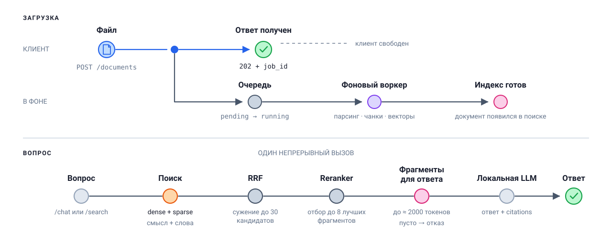
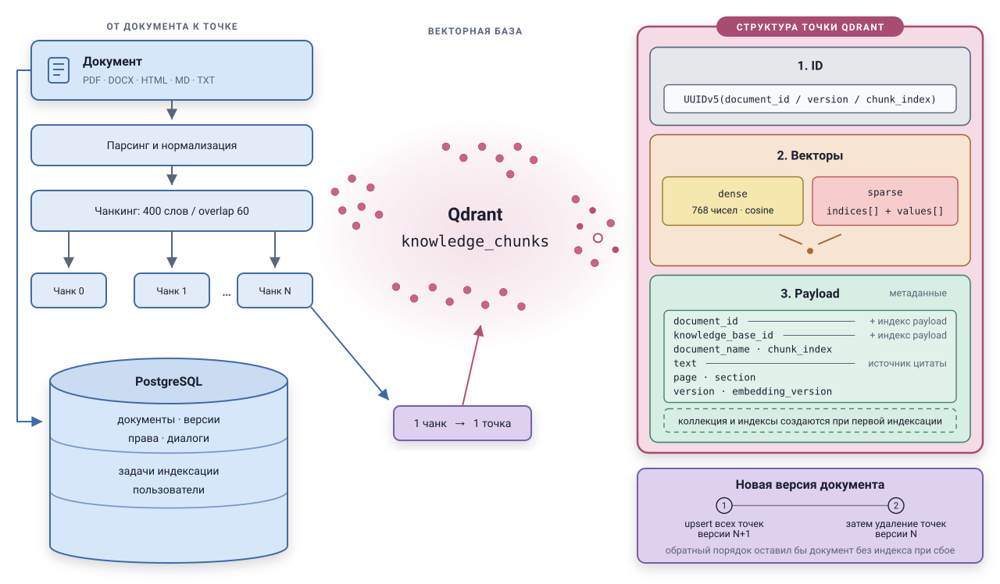
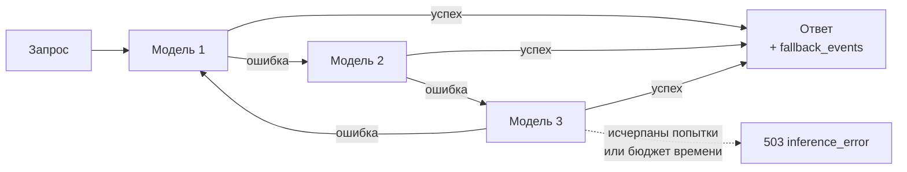
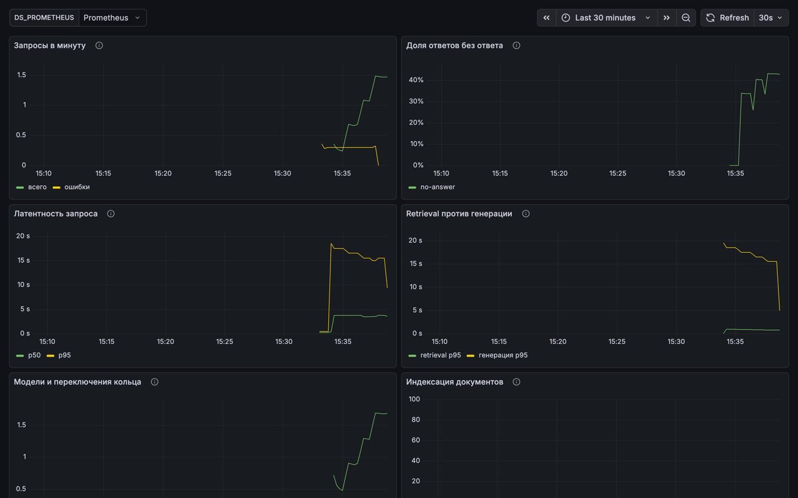

# Local Knowledge RAG Platform


Полностью локальная RAG-платформа для интеллектуального поиска и ответов
по внутренним документам организации.

> **найди → отфильтруй → проверь → объясни → покажи источник — полностью локально.**

https://github.com/user-attachments/assets/d8ed122e-f2bf-4c3a-ae6e-a407af15761e

*Вход и переключение темы (тёмная → светлая → системная) → создание второй
базы знаний и загрузка в неё документов с фоновой индексацией → вопрос по
новой базе одной из подсказок: ответ со ссылкой на документ и его раздел →
поиск без генерации по первой базе → настройка кольца моделей: в состав
добавляется установленная модель вне профиля железа, кольцо перестраивается
перетаскиванием, и новый порядок обхода сохраняется.*

*Всё в Docker Compose на профиле `light` — кольцо из установленных моделей
профиля, `qwen3:4b` и `gemma3:4b`, через Ollama на хосте; `llama3.1:8b` не
скачана, поэтому в кольцо не попадает. В конце в состав добавляется
`llava:latest` — модель вне профиля, доступная только потому, что стоит в
runtime, — а `qwen3:4b` перетаскивается в конец, и основной моделью
становится `gemma3:4b`.*

## Ключевой инвариант

Документы, chunks, embeddings, retrieved context и пользовательские запросы
**не покидают локальную инфраструктуру**. Скрытого cloud fallback не существует:
если локальный inference недоступен, API возвращает `503 inference_error`,
а не отправляет корпоративный контекст во внешний AI-провайдер.

Отсюда следует и вся отказоустойчивость системы: подстраховаться облаком
нельзя, поэтому запас прочности набирается локально — [кольцом моделей](#отказоустойчивость-кольцо-моделей)
и [честным отказом](#честный-отказ) вместо выдуманного ответа.

## Содержание

- [Особенности](#особенности) · [Как это работает](#как-это-работает) · [Хранение](#хранение)
- [Отказоустойчивость: кольцо моделей](#отказоустойчивость-кольцо-моделей) · [Честный отказ](#честный-отказ) · [Профили железа](#профили-железа)
- [Запуск](#запуск) · [Веб-интерфейс](#веб-интерфейс) · [Аутентификация](#аутентификация) · [API](#api) · [Конфигурация](#конфигурация)
- [Тесты](#тесты) · [Наблюдаемость](#наблюдаемость) · [Оценка качества](#оценка-качества) · [Статус](#статус)

## Особенности

| Возможность | Как устроена |
|---|---|
| **Свой RAG-пайплайн** | Без LangChain, LlamaIndex и прочих orchestration-фреймворков. Каждый слой — chunking, retrieval, fusion, reranking, context building — можно прочитать и понять целиком |
| **Hybrid retrieval** | Dense-эмбеддинги ловят смысловую близость, sparse-векторы — точные лексические совпадения (номера статей, коды); объединяются через Reciprocal Rank Fusion |
| **Локальный reranker** | Cross-encoder сужает 20–30 кандидатов до лучших 5–10. В Docker уже установлен и включён; при установке из исходников доступен как extra |
| **Grounded-ответы с citations** | Модель обязана ссылаться на номера фрагментов; ссылки на несуществующие фрагменты отбрасываются |
| **Честный отказ** | При нехватке данных возвращается «ответа нет» с машиночитаемой причиной, а не догадка |
| **Hardware-aware выбор моделей** | Детекция CPU/RAM/GPU/VRAM, рекомендация профиля LIGHT/STANDARD/PERFORMANCE с возможностью переопределить вручную |
| **Кольцевой fallback** | Модель 1 → Модель 2 → Модель 3 с health-состояниями, cooldown и ограничением попыток на один запрос |
| **Изоляция и права** | База знаний — единица изоляции; роли VIEWER/EDITOR/OWNER применяются и как фильтр retrieval |
| **Версионирование документов** | Новая версия документа загружается поверх старой, история версий сохраняется; переиндексация при смене чанкинга или embedding-модели версию не плодит |
| **Наблюдаемость** | Метрики Prometheus и готовый дашборд Grafana из коробки |
| **Веб-интерфейс** | Отдаётся тем же приложением: базы знаний, загрузка документов, поиск, вопрос-ответ и состояние кольца моделей — без отдельной сборки и node-тулчейна |

## Как это работает

<picture>
  <source media="(prefers-color-scheme: dark)" srcset="docs/assets/how-it-works-dark.svg">
  <source media="(prefers-color-scheme: light)" srcset="docs/assets/how-it-works-light.svg">
  
</picture>

Очередь индексации держит Redis, задачи выполняет Celery-воркер. Где при этом
оказываются документы и векторы — показывает схема хранения ниже.

## Хранение

Данные лежат в двух местах, и разделение между ними жёсткое. В PostgreSQL —
документы, их версии, права на базы знаний, диалоги и задачи индексации.
В векторной базе — только чанки: текст фрагмента и всё, что нужно для
фильтрации и цитаты, чтобы поиск не ходил за этим в PostgreSQL. Сам файл
целиком не хранится ни там, ни там — он лежит на диске под собственным
идентификатором, а в базе остаются путь и контрольная сумма.

<picture>
  <source media="(prefers-color-scheme: dark)" srcset="docs/assets/qdrant-data-storage-dark.svg">
  <source media="(prefers-color-scheme: light)" srcset="docs/assets/qdrant-data-storage-light.svg">
  
</picture>

Один чанк — одна точка с двумя именованными векторами (dense и sparse) и
payload:

| Поле | Зачем |
|---|---|
| `knowledge_base_id` | фильтр по базе знаний, есть индекс payload |
| `document_id` | фильтр по документу и удаление версии, есть индекс payload |
| `document_name` | подпись в citations без запроса в PostgreSQL |
| `chunk_index` | порядок чанков при сборке контекста |
| `text` | сам фрагмент — источник контекста и цитаты |
| `page`, `section` | ссылка на страницу PDF или заголовок раздела |
| `version` | версия документа; старая удаляется точечно |
| `embedding_version` | какой моделью посчитан вектор — нужно при переиндексации |

Размерность dense-вектора задаётся `EMBEDDING_DIM` (по умолчанию 768).
Коллекция создаётся при первой индексации, вместе с ней — индексы payload по
`knowledge_base_id` и `document_id`.

**Версии живут в двух режимах, и их легко перепутать.** В PostgreSQL история
версий накапливается: строки `document_versions` не удаляются, у документа
двигается `current_version`. В векторной базе, наоборот, остаётся только
текущая версия: `version` входит в идентификатор точки, поэтому при
переиндексации сначала записываются все точки версии N+1 и лишь потом
удаляются точки версии N. Обратный порядок оставил бы документ без индекса,
если запись упадёт на середине.

## Отказоустойчивость: кольцо моделей

Локальный inference падает иначе, чем облачный: модель может не поместиться в
память, runtime — перезапуститься, генерация — упереться в таймаут. Уйти в
облако нельзя (см. [ключевой инвариант](#ключевой-инвариант)), поэтому
несколько моделей выстроены в **непрерывное кольцо**: при ошибке запрос
уходит следующей модели, а не пользователю.



Номера — это порядок обхода, а не конкретные модели: состав по умолчанию
берётся из [профиля железа](#профили-железа), но и состав, и порядок
меняются вручную, а моделей в кольце может быть и меньше трёх, и больше.

Кольцо непрерывно на уровне сервиса, но **один запрос по нему не циркулирует
бесконечно**: его ограничивают `MODEL_RING_MAX_ATTEMPTS` (по умолчанию 3) и
`MODEL_RING_TIMEOUT_BUDGET_S` (300 с). Бюджет считается на весь запрос и
проверяется перед вызовом очередной модели — идущую генерацию он не обрывает,
поэтому он должен быть заметно больше `INFERENCE_TIMEOUT_S` (120 с): иначе
первая же зависшая модель израсходует бюджет и до соседней дело не дойдёт.
Модели, ушедшие в cooldown, пропускаются без ожидания — текущий запрос не
платит за чужую деградацию.

Каждая модель кольца живёт в одном из состояний:

| Состояние | Когда наступает | Что значит для запроса |
|---|---|---|
| `healthy` | Последняя генерация успешна | Обычный кандидат |
| `degraded` | Была ошибка, но порог ещё не достигнут | Ещё используется, попытки считаются |
| `cooldown` | `MODEL_RING_FAILURE_THRESHOLD` ошибок подряд (по умолчанию 2) | Пропускается `MODEL_RING_COOLDOWN_S` секунд (60 с) |
| `unavailable` | Модель не установлена в runtime | Пропускается до загрузки весов |

Восстановление автоматическое: по истечении cooldown модель возвращается в
кольцо как `degraded` и получает ещё один шанс — «чинить» её вручную не нужно.
Переключения не молчаливые: каждое попадает в лог, в метрики и в трассировку
запроса, так что деградация видна на дашборде, а не только по возросшей латентности.

Текущее состояние кольца:

```bash
curl http://localhost:8000/inference/status
```

Кольцо отключается через `MODEL_RING_ENABLED=false` — тогда используется одна
модель из `LLM_MODEL`.

## Честный отказ

Retrieval сам по себе молчать не умеет: косинусная близость не бывает нулевой,
и на вопрос без ответа в базе он всё равно вернёт документы. Поэтому решение
«ответа нет» принимает отдельная политика — по собранному контексту и по тому,
что вернула модель. Ответ приходит с `has_answer: false` и причиной:

| Код | Что произошло |
|---|---|
| `empty_context` | Retrieval не дал ни одного фрагмента |
| `below_threshold` | Найденное не прошло порог релевантности (если он задан) |
| `model_declined` | Модель сама сообщила, что данных недостаточно |
| `no_citations` | Ответ был, но не сослался ни на один реальный фрагмент — проверить его нечем |

Порог релевантности по умолчанию выключен: он живёт в шкале конкретной
embedding-модели, и зашитое число врало бы при её замене. Подбирается прогоном
`scripts/evaluate_retrieval.py`, где видна цена — ложные срабатывания падают
вместе с Recall.

## Профили железа

`GET /system/hardware` определяет CPU/RAM/GPU/VRAM и рекомендует профиль;
рекомендация переопределяется через `HARDWARE_PROFILE_OVERRIDE`.

| Профиль | Требования | Кольцо моделей |
|---|---|---|
| **LIGHT** | от 8 ГБ RAM, GPU не нужен | `qwen3:4b` → `gemma3:4b` → `llama3.1:8b` |
| **STANDARD** | от 24 ГБ RAM и 12 ГБ VRAM | `qwen3:14b` → `gemma3:12b` → `llama3.1:8b` |
| **PERFORMANCE** | от 64 ГБ RAM и 24 ГБ VRAM | `qwen3:32b` → `gemma3:27b` → `llama3.1:70b` |

На Apple Silicon память унифицирована, поэтому VRAM отдельно не проверяется —
профиль выбирается по общему объёму RAM.

## Запуск

Пять команд от клона до работающего интерфейса с готовой базой знаний.
Нужны только Docker и [Ollama](https://ollama.com) на хосте — в контейнере нет
доступа к Metal на macOS и к GPU на Linux без отдельной настройки.

```bash
git clone https://github.com/SlavaKlkv/local_knowledge_rag.git && cd local_knowledge_rag
ollama pull qwen3:4b && ollama pull nomic-embed-text
SECRET_KEY=$(openssl rand -hex 32) docker compose up -d
docker compose exec api python -m scripts.seed_demo
open http://localhost:8000
```

При первом запуске Docker собирает образ с локальным cross-encoder и его
весами. После этого Compose поднимает всё сразу — приложение, воркер,
PostgreSQL, Qdrant и Redis;
интерфейс открывается на [localhost:8000](http://localhost:8000), схема API —
на [localhost:8000/docs](http://localhost:8000/docs). Настройки берутся из
окружения, за образец — [.env.example](.env.example).

Четвёртая команда создаёт пользователя `demo@example.com` / `demo-password` и
**две** базы знаний, чтобы сразу было видно, что документы делятся по
областям, а поиск идёт по выбранной базе:

| База знаний | Документы | Откуда |
|---|---|---|
| Внутренние документы | регламент дежурств, политика командировок, онбординг — три разных формата | [docs/demo/internal/](docs/demo/internal/) |
| Безопасность и доступы | парольная политика, регламент доступа к продовым системам | [docs/demo/security/](docs/demo/security/) |

Скрипт ждёт окончания индексации и печатает, чем всё закончилось; повторный
запуск ничего не дублирует.

Для проверки reranker после наполнения демо-данными во вкладке **Поиск**
введите `дежурства`. Сначала должны идти разделы
`dezhurstva.md`, а фрагменты про удалённую работу должны исчезнуть из выдачи —
русскоязычный cross-encoder отсекает их по порогу
`SEARCH_MIN_RERANK_SCORE=0.2`. В правом верхнем углу результата показывается
score cross-encoder: чем он выше, тем релевантнее фрагмент в рамках текущего
запроса; это не гарантированный процент вероятности.

Что спросить в интерфейсе, чтобы увидеть главное:

| Вопрос | Что он показывает |
|---|---|
| Как компенсируется дежурство в выходной? | Ответ со ссылкой на документ и его раздел (`.md`) |
| Какие лимиты на проживание в командировке? | Числа из `.txt`, не выдуманные моделью |
| Сколько длится испытательный срок? | Ответ собран из HTML-документа — форматы равноправны |
| Какой минимальной длины должен быть пароль? | Ответ из второй базы — область поиска задаётся выбором базы |
| Какая погода завтра в Париже? | **Честный отказ**: «ответа в документах нет» с причиной |

Последний вопрос — самый показательный: система не догадывается, а признаёт
отсутствие данных. Дальше можно загрузить свой PDF или DOCX кнопкой
«Загрузить документ» и задать вопрос по нему — статус индексации обновляется
в списке сам.

Особенности контейнера, о которых стоит знать сразу:

| Что | Почему | Как переопределить |
|---|---|---|
| Модель самая лёгкая | `qwen3:4b` — 2.6 ГБ; на машине с 24+ ГБ памяти качество заметно выше | `ollama pull qwen3:14b` и `HARDWARE_PROFILE_OVERRIDE=standard docker compose up -d` |
| Образ больше базовой Python-установки | Docker включает `sentence-transformers`, CPU-версию torch и веса русскоязычного `DiTy/cross-encoder-russian-msmarco`, чтобы reranking работал сразу | Для экономии памяти можно запустить с `RERANK_ENABLED=false`; зависимости останутся в образе |
| Профиль занижается | Детекция железа внутри контейнера видит лимиты Docker, а не хост: на macOS это обычно 4–8 ГБ RAM и `gpu: none` | `HARDWARE_PROFILE_OVERRIDE=standard docker compose up -d` |

Установка из исходников без Docker, загрузка весов и ручная настройка кольца
моделей — в [docs/setup.md](docs/setup.md).

## Веб-интерфейс

Приложение отдаёт интерфейс на корне (`/`), статику — из `/ui`. Отдельного
процесса, сборки и настройки CORS не нужно: страница и API живут на одном
origin, а сам интерфейс написан без фреймворка и сборочного тулчейна —
[app/web/static/](app/web/static/).

Что в нём есть:

| Экран | Что делает |
|---|---|
| Базы знаний | Создание и переключение; список ограничен доступными пользователю |
| Документы | Загрузка и статус индексации, который обновляется, пока воркер работает |
| Вопрос-ответ | Ответ с источниками, использованной моделью и латентностью; при нехватке данных — блок «ответа в документах нет» с причиной |
| Подсказки вопросов | Пустой диалог предлагает вопросы, ответы на которые есть в документах демо-баз; у базы, созданной пользователем, подсказок нет |
| Поиск | Фрагменты и их score без генерации — видно, что именно нашёл retrieval |
| Кольцо моделей | Состав кольца и здоровье каждой модели, включая `не установлена`; кнопка «Настроить» меняет состав и порядок обхода |

Тема переключается в шапке: `Светлая` · `Тёмная` · `Системная`. Выбор
запоминается в `localStorage`, по умолчанию используется системная; палитры
описаны токенами в [styles.css](app/web/static/styles.css).

Правки статики видны без пересборки образа, если смонтировать её в контейнер:

```bash
cp docker-compose.override.yml.example docker-compose.override.yml
docker compose up -d api
```

Интерфейс — не отдельный продукт, а витрина API: всё, что он делает, доступно
теми же публичными эндпоинтами.

## Аутентификация

`/system`, `/inference` и `/metrics` открыты, остальные группы требуют
JWT-токена — без заголовка `Authorization` они отвечают `401`:

```bash
curl -X POST http://localhost:8000/auth/register \
  -H 'Content-Type: application/json' \
  -d '{"email": "me@example.com", "password": "change-me-please"}'
```

Войти и сохранить токен:

```bash
TOKEN=$(curl -s -X POST http://localhost:8000/auth/login \
  -H 'Content-Type: application/json' \
  -d '{"email": "me@example.com", "password": "change-me-please"}' \
  | python -c 'import json,sys; print(json.load(sys.stdin)["access_token"])')
```

Получить доступные базы знаний:

```bash
curl http://localhost:8000/knowledge-bases -H "Authorization: Bearer $TOKEN"
```

Создатель базы знаний становится её владельцем; остальным доступ выдаётся
явно — `POST /knowledge-bases/{id}/permissions` с ролью `viewer`, `editor`
или `owner`. Права проверяются не только на входе в эндпоинт, но и как фильтр
retrieval: фрагменты чужой базы знаний не попадают даже в контекст ответа.

Токены подписываются `SECRET_KEY` — в проде его обязательно переопределить.

## API

| Группа | Назначение | Токен |
|---|---|:---:|
| `/` и `/ui` | Веб-интерфейс и его статика | — |
| `/auth` | Регистрация, вход, текущий пользователь | — |
| `/system` | Состояние приложения, железо, рекомендуемый профиль | — |
| `/inference` | Runtime'ы, кольцо моделей, их установка и загрузка | — |
| `/metrics` | Метрики Prometheus | — |
| `/knowledge-bases` | Базы знаний, их переименование, удаление и права доступа | ✅ |
| `/documents` | Загрузка, версии, переиндексация, статус и удаление | ✅ |
| `/indexing-jobs` | Прогресс фоновой индексации | ✅ |
| `/search` | Поиск по базе знаний без генерации | ✅ |
| `/conversations` | Диалоги и история сообщений | ✅ |
| `/chat` | Вопрос-ответ с citations | ✅ |

Поддерживаемые форматы документов: PDF, DOCX, HTML, Markdown, TXT.

Ответ `/chat` кроме текста и citations возвращает `has_answer`, причину отказа,
использованную модель и провайдера, латентность и переписанный запрос — то есть
всё, по чему ответ можно проверить, не заглядывая в логи.

## Конфигурация

Все параметры — через переменные окружения, см. [.env.example](.env.example):

| Блок | Ключевые переменные |
|---|---|
| Хранилища | `POSTGRES_*`, `QDRANT_URL`, `REDIS_URL`, `CELERY_TASK_ALWAYS_EAGER` |
| Auth | `SECRET_KEY`, `ACCESS_TOKEN_TTL_S` |
| Inference | `INFERENCE_PROVIDER=ollama\|vllm`, `OLLAMA_URL`, `VLLM_URL`, `LLM_MODEL`, `EMBEDDING_MODEL`, `INFERENCE_TIMEOUT_S` |
| Кольцо моделей | `MODEL_RING_ENABLED`, `MODEL_RING_MAX_ATTEMPTS`, `MODEL_RING_TIMEOUT_BUDGET_S`, `MODEL_RING_COOLDOWN_S`, `MODEL_RING_FAILURE_THRESHOLD` |
| Retrieval | `HYBRID_RETRIEVAL_ENABLED`, `RERANK_ENABLED`, `RERANK_CANDIDATES`, `RERANK_TOP_K`, `SEARCH_MIN_RERANK_SCORE` |
| Честный отказ | `NO_ANSWER_REQUIRE_CITATIONS`, `NO_ANSWER_MIN_SCORE` |
| Железо | `HARDWARE_PROFILE_OVERRIDE`, `RUNTIME_INSTALL_ENABLED` |

## Тесты

```bash
uv run pytest
```

Проверить стиль кода:

```bash
uv run ruff check .
```

Тесты Qdrant — интеграционные, против реально поднятого сервиса; при его
отсутствии они пропускаются.

## Наблюдаемость

Метрики Prometheus — на `/metrics`; Prometheus и Grafana с готовым дашбордом
поднимаются профилем `observability`:

```bash
docker compose --profile observability up -d
```



Дашборд провижионится сам, логин — `admin` / `admin` (переопределяется
`GRAFANA_PASSWORD`). Подробнее — в [docs/observability.md](docs/observability.md).

## Оценка качества

Качество retrieval измеряется на размеченном датасете: Recall@K, Precision@K,
MRR, nDCG@K и доля ложных срабатываний на вопросах без ответа.

```bash
uv run python -m scripts.evaluate_retrieval docs/evaluation/example_dataset.json --k 1 3 5
```

Качество ответов измеряется отдельно — обоснованность, точность цитат и
честный отказ на вопросах без ответа:

```bash
uv run python -m scripts.evaluate_rag docs/evaluation/example_dataset.json --top-k 5
```

Модели кольца сравниваются между собой по качеству и скорости на одном
датасете:

```bash
uv run python -m scripts.benchmark_models docs/evaluation/example_dataset.json
```

Формат датасета, смысл каждой метрики и результаты прогонов —
в [docs/evaluation/README.md](docs/evaluation/README.md).

## Статус

Реализованы все пять этапов: ядро RAG, продвинутый retrieval, локальная
inference-платформа, production-бэкенд и AI quality — измеримое качество,
честный отказ и наблюдаемость. Состав этапов — в
[docs/roadmap.md](docs/roadmap.md).

## Лицензия

[MIT](LICENSE)
