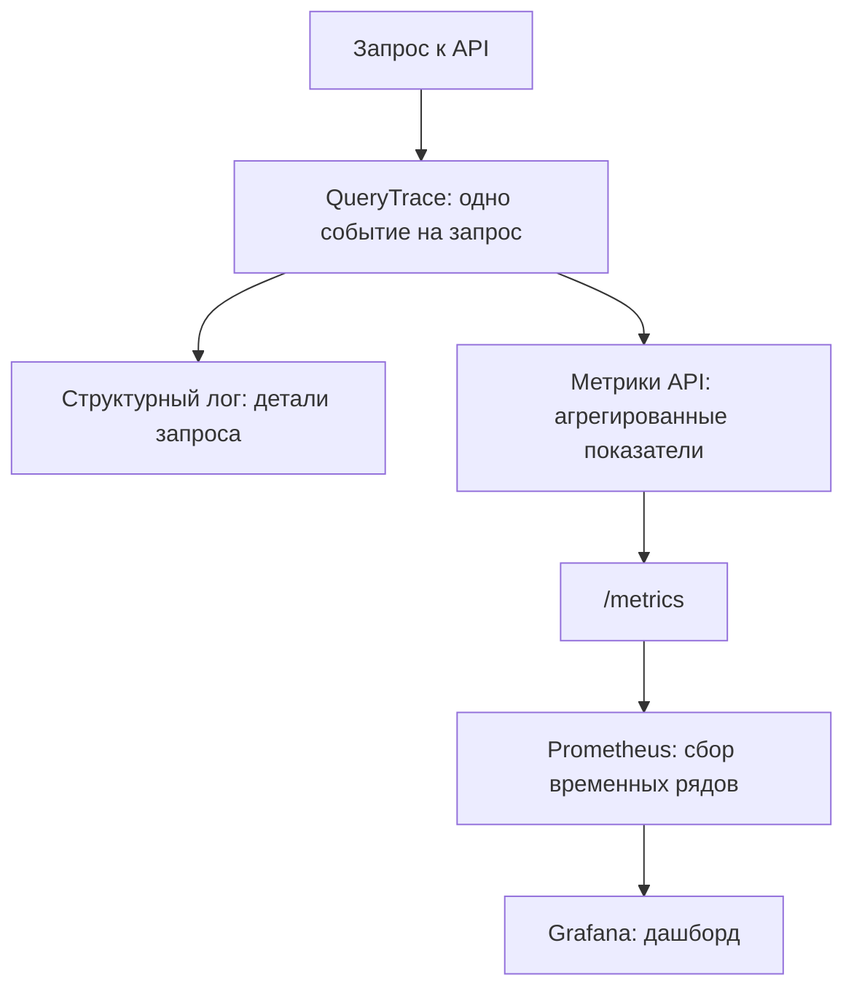
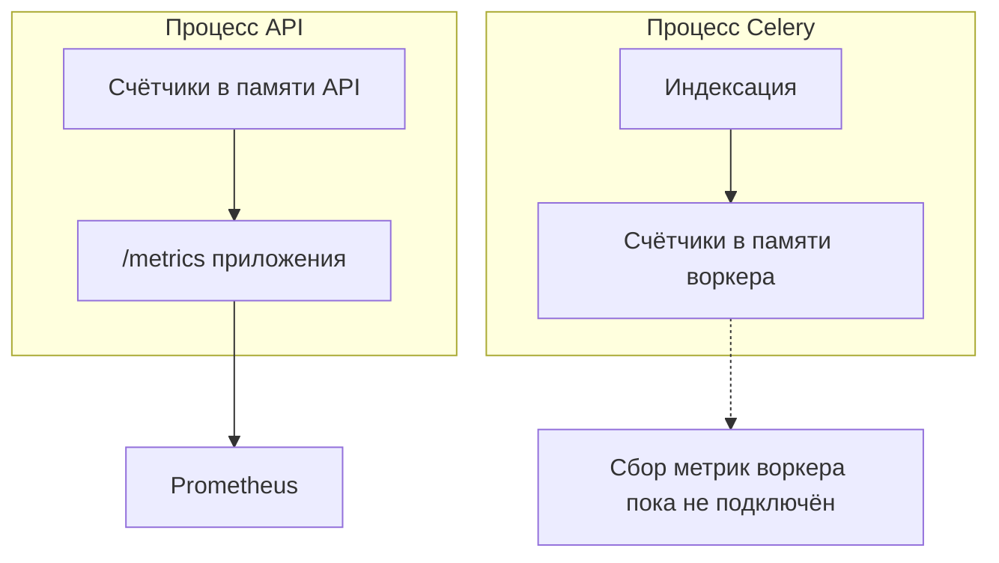

# Наблюдаемость

Одно событие на запрос собирается в `QueryTrace` и уходит двум потребителям
сразу: в структурный лог и в метрики Prometheus. Это сделано намеренно —
два независимых места сбора неизбежно разъехались бы, и графики начали бы
противоречить логам.



## Содержание

- [Почему в метках нет идентификаторов](#почему-в-метках-нет-идентификаторов)
- [Что измеряется](#что-измеряется)
- [Запуск](#запуск)
- [Ограничение метрик воркера](#метрики-воркера-собираются-отдельно)
- [Дашборд](#дашборд)

Разделение обязанностей между ними жёсткое:

| Источник | На какой вопрос отвечает | Содержимое |
|:---|:---|:---|
| **Логи** | Что произошло в конкретном запросе? | Текст запроса, идентификаторы базы знаний и фрагментов, скоры |
| **Метрики** | Как система живёт в целом? | Агрегированные показатели без идентификаторов запросов, баз знаний и фрагментов |

## Почему в метках нет идентификаторов

Каждое уникальное значение метки — отдельный временной ряд. Пара сотен баз
знаний превратила бы десяток метрик в тысячи рядов и положила бы Prometheus
задолго до того, как такая детализация кому-то понадобилась. По той же причине
в метку ошибки идёт её **класс**, а не текст: в тексте бывают имена моделей,
пути и идентификаторы.

Побочное следствие полезно само по себе: раз в метриках нет ни текстов
запросов, ни идентификаторов, эндпоинт `/metrics` можно оставить без
аутентификации — scrape выполняет Prometheus внутри сети, и токен в его
конфиге ничего бы не защитил, зато усложнил бы эксплуатацию.

## Что измеряется

| Метрика | Смысл |
|---|---|
| `rag_queries_total{has_answer}` | Запросы с разбивкой на «ответили» и «честно промолчали» |
| `rag_query_errors_total{error_type}` | Ошибки по классам: inference, not_found, forbidden, other |
| `rag_query_latency_seconds` | Полная латентность запроса |
| `rag_retrieval_latency_seconds` | Поиск кандидатов вместе с reranking |
| `rag_generation_latency_seconds` | Генерация ответа |
| `rag_retrieved_chunks` | Сколько фрагментов попало в контекст |
| `rag_model_usage_total{model,provider}` | Обращения к моделям |
| `rag_model_fallback_total{from_model,to_model}` | Переключения кольца моделей |
| `rag_documents_indexed_total{status}` | Индексации документов |
| `rag_chunks_indexed_total` | Записанные фрагменты |

Границы гистограмм заданы явно: дефолтные бакеты `prometheus_client`
рассчитаны на веб-запросы в десятки миллисекунд, тогда как локальная генерация
занимает единицы и десятки секунд — всё интересное схлопывалось бы в верхний
бакет.

## Запуск

Prometheus и Grafana вынесены в профиль `observability`, чтобы обычная
разработка не тянула два лишних контейнера:

```bash
docker compose --profile observability up -d
```

| Сервис | Открыть | Доступ |
|:---|:---|:---|
| Метрики приложения | [/metrics](http://localhost:8000/metrics) | Без токена |
| Prometheus | [localhost:9090](http://localhost:9090) | Внутри локальной сети |
| Grafana | [localhost:3000](http://localhost:3000) | `admin` / `GRAFANA_PASSWORD`, пароль по умолчанию `admin` |

Источник данных и дашборд поднимаются автопровижионингом из `deploy/grafana/` —
руками в интерфейсе настраивать ничего не нужно. Порты Prometheus и Grafana
наружу выставлять не следует.

## Метрики воркера собираются отдельно



> **Нули в метриках индексации API не означают отсутствия индексации.**
> Текущее состояние проверяйте через `/indexing-jobs` и статус документа.

`prometheus_client` держит счётчики в памяти процесса, а индексация выполняется
в воркере Celery — это отдельный процесс от API. Поэтому `/metrics` приложения
показывает `rag_documents_indexed_total` и `rag_chunks_indexed_total` всегда
нулевыми: индексация их увеличивает, но в другом процессе.

Это ограничение архитектуры, а не недоделка конкретной метрики: любой счётчик,
инкрементируемый в воркере, ведёт себя так же. Чтобы видеть индексацию на
графиках, нужен либо отдельный scrape-эндпоинт в воркере, либо Pushgateway —
и то и другое выходит за рамки текущей сборки. Пока состояние индексации
надёжнее смотреть через `/indexing-jobs` и статус документа, а не через метрики.

## Дашборд

Шесть панелей, каждая отвечает на конкретный эксплуатационный вопрос:

> Панель индексации ограничена раздельной памятью API и Celery:
> для реальных значений нужен дополнительный сбор метрик воркера, описанный выше.

| Панель | Зачем |
|---|---|
| Запросы в минуту | Рост ошибок при ровном трафике — первый признак недоступного inference |
| Доля ответов без ответа | Резкий рост означает, что retrieval перестал находить нужное, — видно раньше, чем пожалуются пользователи |
| Латентность запроса (p50/p95) | Хвост отличает «обычно быстро» от «иногда неприемлемо долго» |
| Retrieval против генерации | Показывает, куда уходит время: оптимизировать retrieval, когда 90% занимает генерация, бессмысленно |
| Модели и переключения кольца | Постоянный ненулевой fallback означает, что основная модель кольца нездорова |
| Индексация документов | Ненулевая доля `failed` при работающей индексации — обычно недоступная embedding-модель |
