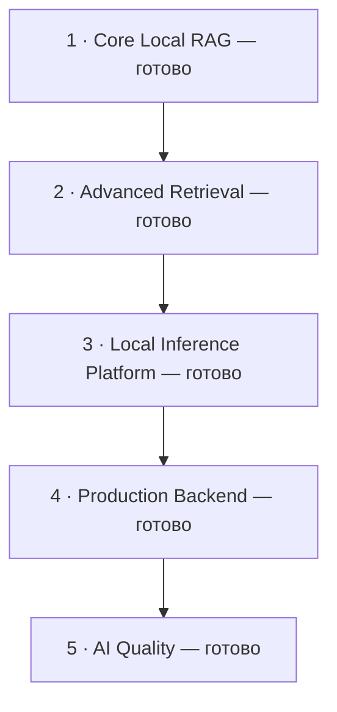

# Roadmap

Все пять этапов отмечены как реализованные. Ниже — последовательность развития
платформы и состав каждого этапа.

| Этап | Результат | Состав |
|:---|:---|:---|
| 1. Core Local RAG | Локальный ответ по документам с цитатами | [Подробнее](#stage-1--core-local-rag-) |
| 2. Advanced Retrieval | Расширенные форматы и более точный поиск | [Подробнее](#stage-2--advanced-retrieval-) |
| 3. Local Inference Platform | Выбор моделей под железо и локальный fallback | [Подробнее](#stage-3--local-inference-platform-) |
| 4. Production Backend | Фоновые задачи, версии документов и права | [Подробнее](#stage-4--production-backend-) |
| 5. AI Quality | Измерение качества, честный отказ и наблюдаемость | [Подробнее](#stage-5--ai-quality-) |

## Stage 1 — Core Local RAG ✅

FastAPI, PostgreSQL, Qdrant, Ollama, local LLM, local embeddings, PDF/TXT,
chunking, dense retrieval, generation, citations.

## Stage 2 — Advanced Retrieval ✅

Остальные форматы документов, metadata filters, hybrid retrieval,
локальный reranker, query rewriting, configurable chunking.

## Stage 3 — Local Inference Platform ✅

LocalLLMProvider, OllamaProvider, VLLMProvider, HardwareDetector,
RuntimeDetector, ProfileRecommender, профили LIGHT/STANDARD/PERFORMANCE,
ручное переопределение профиля, предложение установки Ollama,
проверка доступности и загрузка моделей, persistent model storage,
кольцевой fallback Qwen/Gemma/Llama, health checks, cooldown, failover.

## Stage 4 — Production Backend ✅

Redis, Celery, асинхронная индексация, document lifecycle, versioning,
reindex, auth, permissions, conversations, Docker Compose.

## Stage 5 — AI Quality ✅

Evaluation dataset, retrieval metrics, RAG evaluation, LLM benchmark,
profile benchmark, no-answer, Prometheus/Grafana, observability.

## Сверх плана — веб-интерфейс ✅

Витрина API без сборочного тулчейна: базы знаний, загрузка документов со
статусом индексации, поиск, вопрос-ответ с citations и честным отказом,
состояние кольца моделей. Отдаётся самим приложением на `/`.

Практические инструкции: [быстрый старт](../README.md#быстрый-старт),
[оценка качества](evaluation/README.md), [наблюдаемость](observability.md).
